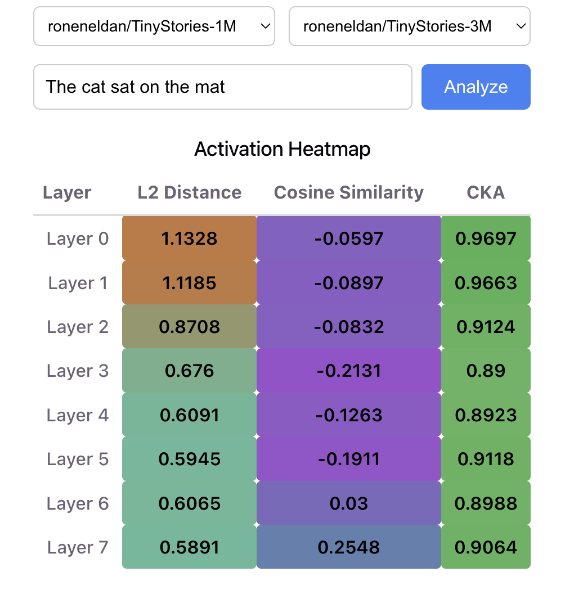
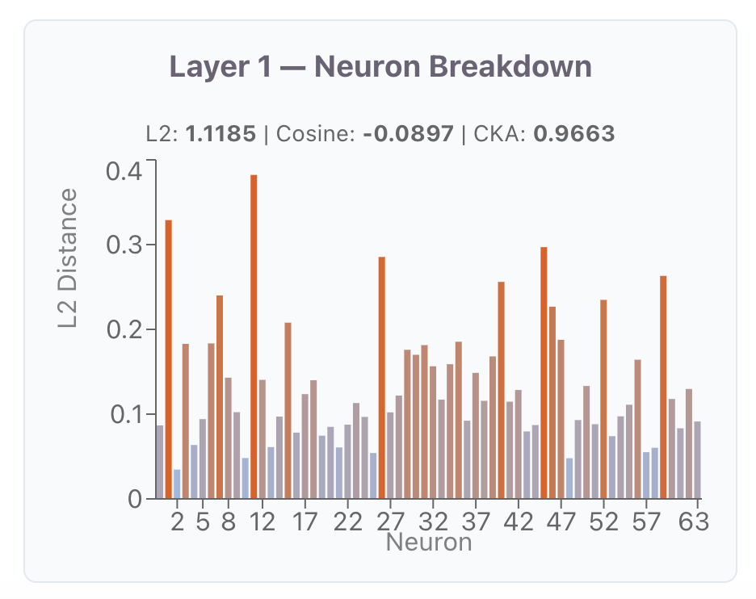

# Interp Explorer

An interactive tool for comparing the internal representations of two language models. Enter a sentence, pick two models, and see exactly where and how their activations diverge — layer by layer, and neuron by neuron.

Built as a companion tool to my research on comparing full-rank and low-rank (FiRA) pretraining in small LLaMA models, where the core question is *where* in a network two differently-trained models start to disagree.





## What it does

Most interpretability comparisons live in notebooks — one plot per question, re-run by hand. Interp Explorer makes the same analysis interactive, with three levels of detail:

**Layer overview.** A color-coded heatmap of every layer, scored on three metrics at once:

- **L2 distance** — how far apart the two models' mean activations are in absolute terms
- **Cosine similarity** — whether the activations point in the same direction, ignoring magnitude
- **CKA (Centered Kernel Alignment)** — whether the two models organize their representation space similarly, even if individual neurons don't line up

**Layer comparison.** A bar chart of any single metric across depth, so trends are visible at a glance — for example, divergence peaking in early layers and recovering later.

**Neuron drill-down.** Click any layer to see per-neuron L2 distances within it. This surfaces the cases where a layer's overall divergence is driven by a small number of outlier neurons rather than spread evenly across the layer.

## Tech stack

**Backend** — FastAPI, PyTorch, HuggingFace Transformers. Activations are captured with forward hooks registered on every transformer block, then compared with per-layer and per-neuron metrics. Models are loaded lazily and cached in memory, so switching between them is instant after the first load.

**Frontend** — React, TypeScript, Vite, Recharts. Selecting a layer in either the heatmap or the bar chart triggers a fetch for that layer's neuron breakdown.

## Running locally

Requires Python 3.12+ and Node 20+.

**Backend:**

```bash
cd backend
python3.12 -m venv venv
source venv/bin/activate
pip install fastapi uvicorn python-multipart torch transformers
uvicorn main:app --reload
```

The server starts on `http://127.0.0.1:8000`. Interactive API docs are at `/docs`.

**Frontend** (in a second terminal):

```bash
cd frontend
npm install
npm run dev
```

Open `http://localhost:5173`.

Model weights download from HuggingFace on first use, so the first analysis with a given model takes a few extra seconds.

## API

| Endpoint | Method | Description |
|---|---|---|
| `/models` | GET | List available models for comparison |
| `/analyze` | POST | Per-layer L2, cosine, and CKA for a given input |
| `/neurons/{layer_idx}` | POST | Per-neuron L2 distances within one layer |

`/analyze` and `/neurons` accept `{ "text": ..., "model_a": ..., "model_b": ... }`.

## Notes and limitations

- The bundled model presets are the TinyStories family (1M–33M), chosen because they load in seconds and run comfortably on CPU. Pointing the backend at a local checkpoint is a one-line change in `get_model()`.
- When the two selected models have different hidden sizes, activations are truncated to the smaller dimension before comparison. This is a convenience for exploring mismatched models — comparisons between models of identical architecture (the intended use case) are unaffected.
- CKA requires centering across tokens, so it is only meaningful for inputs of more than one token. Very short inputs will return zero.

## Roadmap

- Logit lens view — how token predictions evolve through depth
- Support for arbitrary HuggingFace model IDs, not just presets
- Export charts as figures for papers